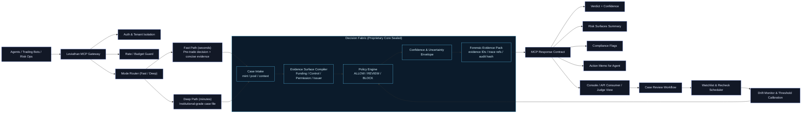

# causal_funding Eternal

`causal_funding` is a Solana-native, decision-grade risk intelligence system for listing review, investment screening, and pre-trade gating.

**From raw on-chain noise to an auditable BLOCK / REVIEW / ALLOW decision in minutes.**

**Leviathan MCP for Web4 agents: machine-consumable decision intelligence for pre-trade and pre-listing controls.**

## Judge TL;DR

- Not a score-only tool: this demo outputs decision + evidence + operating status.
- Built for Solana speed: designed for real-time listing, investment, and pre-trade workflows.
- Agent-driven reasoning layer: converts technical evidence into operator-facing judgment.
- Production-minded quality controls for stable evaluator-facing decisions.
- Internal replay quality band: rug catch `~89%`, safe block `~5%`, block precision `~97%`.

This is not a toy rug checker. The system is designed as a decision workflow:

1. Funding and control analysis
2. Multi-surface risk evaluation
3. Evidence packaging
4. Agent-assisted judgment synthesis
5. ALLOW / REVIEW / BLOCK decision output
6. Ongoing evaluator-facing review workflow

## Web4 Agent and MCP Infrastructure Direction

As Web4 agent-based execution becomes more common on Solana, risk decisions must be machine-consumable, auditable, and repeatable.

`causal_funding` is positioned as decision infrastructure for both operator teams and autonomous workflows:

- Pre-trade decision gate: `ALLOW / REVIEW / BLOCK`
- Multi-surface risk view: funding, control, permissions, and issuer context
- LP Gold verification within the same review flow
- MCP and agent-ready evidence packaging for downstream policy engines

The goal is not to produce another alert feed. The goal is to provide a consistent decision layer that can be integrated into real listing, investing, and trading workflows.



## Why Solana

Solana is one of the best execution environments for real-time products: fast finality, low friction, and high throughput.

That advantage also compresses risk windows. Capital can move fast, narratives can move faster, and manual diligence often arrives too late. `causal_funding` is built for this exact operating reality: make explainable risk decisions at Solana speed.

## What This Demo Proves

The Eternal demo is designed to prove production-minded decision quality, not just dashboard output:

- Input: token mint (pool can be auto-detected)
- Output: structured risk report + evidence package
- Decision layer: ALLOW / REVIEW / BLOCK
- Review layer: decision output, evidence context, and evaluator-facing workflow

## Demo Scope

This repository is the **public demo layer**.

- Public demo repo: product narrative, demo behavior, sample artifacts, and weekly progress.
- Demo shell code: `demo_shell/` for evaluator-facing input, rendering, and demo routing.
- Judge / pilot access: deeper evaluation flow available on request.

The repository is intentionally focused on product behavior, decision outputs, and reviewer-facing materials.

## Demo Shell (Open Source Layer)

`demo_shell` is the upload-ready public layer for Eternal.

- Input collection and mode switching (public/judge)
- API forwarding to configured analysis backend
- Executive decision rendering
- Evidence surfaces for funding, control, permissions, and issuer context
- What-if simulation for evaluator-facing scenario analysis
- Case review and watchlist/recheck workflow
- Fallback sample for presentation safety

Quick run:

```bash
cd demo_shell
cp .env.example .env
pip install -r requirements.txt
python app.py
```

## Judge Access

- Public demo flow: available through this repository and shared demo materials.
- Judge / pilot access: provided in controlled mode upon request.
- Contact for access:
  - Email: `gauss8008@gmail.com`
  - Telegram: `@Leviathan_Gauss`

See [docs/judge-access.md](docs/judge-access.md) for the exact request format.

## Quick Demo Run (Public Repo Operator View)

Run the public shell locally:

```bash
cd demo_shell
cp .env.example .env
pip install -r requirements.txt
python app.py
```

Then open `http://127.0.0.1:7860` and submit a mint.

Optional API call through the shell:

```bash
curl -s -X POST http://127.0.0.1:7860/api/analyze \
  -H 'Content-Type: application/json' \
  -d '{"mint":"DoBAMMqcedjoWV3m7JEU1pAzZjkQqeQzbdLUA2etbonk","judge_mode":false}'
```

Notes:

- When the configured backend is unreachable, the shell returns a clearly marked redacted fallback sample.
- Extended walkthroughs are available in controlled judge/pilot mode.

Expected visible output:

- Risk score + confidence
- ALLOW / REVIEW / BLOCK action
- Evidence summary and review highlights
- Decision-ready evaluator context

## Current Capability Highlights

- Funding and control-surface analysis for evaluator workflows
- Multi-surface risk evaluation
- Review-ready evidence packaging
- Agent-assisted decision narrative for operator review
- Decision output aligned to real review workflows
- Public console for simulation, review, and recheck
- MCP-facing decision outputs designed for agent integration paths

## Week 2 Progress

Week 2 focused on evaluator-facing product depth and runtime hardening.

- Public demo shell upgraded into a Decision Simulation & Review Console
- Controller dossier layer added for stronger operator-facing wallet context
- Token permission surface expanded for better control-risk visibility
- Metadata and issuer-footprint coverage expanded for stronger diligence quality
- Agent final-stage reliability remains under active hardening on live runs

See [docs/week-2-update.md](docs/week-2-update.md) for the full update.

## Internal Calibration Snapshot (Current)

From the current internal provisional labeled set (rounded for public sharing):

- Rug catch rate (BLOCK + REVIEW): `~89%`
- Safe block rate: `~5%`
- Block precision: `~97%`

This is exactly the direction we want for institutional workflows: high catch quality with controlled false blocks.

## Repository Focus

This repository is intentionally product-facing.

Included here:

- Product positioning
- Demo scope
- Roadmap and integration direction
- Public-facing operating narrative

Not included here:

- Full deployment configuration
- Non-public connectors and evaluator access configuration
- Internal operating materials not required for public demo review

## Who This Is Built For

- Exchange listing and risk teams
- Crypto funds and due-diligence teams
- Market makers and launch platforms
- Security and monitoring operators

## Partnering

We are actively open to:

- Strategic capital partners
- Pilot integration partners (exchange/fund/workflow teams)
- Data partners for enrichment and coverage expansion

Current access is controlled for judges and selected pilot counterparts.

## Repository Guide

- `docs/product-positioning.md`
- `docs/demo-scope.md`
- `docs/roadmap.md`
- `docs/judge-access.md`
- `docs/demo-runbook.md`
- `docs/submission-checklist.md`
- `docs/weekly-update-template.md`
- `docs/video-script-weekly.md`
- `docs/demo-shell-architecture.md`
- `docs/week-2-update.md`
- `examples/sample_report_redacted.json`
- `demo_shell/`

## Status

Prepared and actively iterated for Colosseum Eternal (March 2026).
